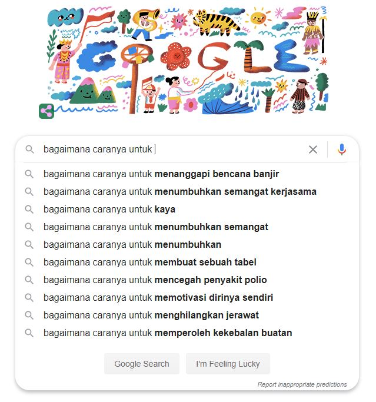

# Auto Completion Text Engine with NLP
 

  
Auto-complete system is something we may see every day, for example:<ul>
    <li>When we google something, we often have suggestions to help us complete our search
    <li>When we are writing an email, we get suggestions telling us possible endings to our sentence
</ul>  

Data source :
- Indonesia Corpus https://dumps.wikimedia.org/idwiki/ (idwiki-latest-pages-articles.xml.bz2)